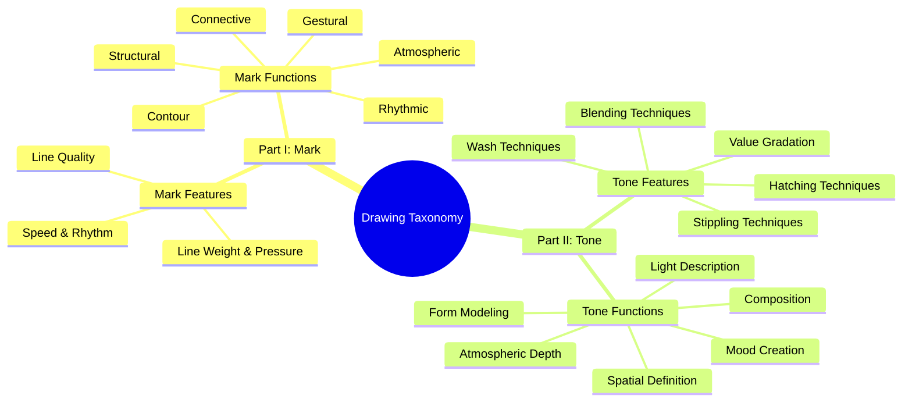

# Drawing Taxonomy

## Part I: Mark

### Mark Features
*(The physical properties of the mark)*

- **Line Weight & Pressure**: The perceived heaviness or lightness of a mark, influenced by tool pressure.
  - **Methods**: Edge Definition (Dürer, Haynes), Foreground Emphasis (Bazicaluva), Visual Grouping (Daumier), Expressive Line Variation (Hokusai), Material Definition (Hollar), Hierarchical Detail (Michelangelo), Sculptural Line Weight (Ingres), Close Study (Ruisdael).
- **Line Quality**: The character of a mark's boundary (e.g., sharp, soft, fuzzy, broken).
  - **Methods**: Psychological Line Quality (Schiele).
- **Speed & Rhythm**: The inferred velocity and cadence of mark-making.
  - *(pending implementation)*

### Mark Functions
*(The job the mark is performing)*

- **Connective**: Bundling shapes/objects/subjects.
  - **Methods**: Cassatt, Gauguin, Moronobu, Rubens.
- **Atmospheric**: Creating mood and dynamic vitality through mark-making.
  - **Methods**: Degas.
- **Structural**: Defining spatial relationships/framework.
  - **Methods**: Van Gogh.
- **Contour**: Following form/defining edges.
  - **Methods**: Rembrandt.
- **Rhythmic**: Creating visual beats/patterns.
  - **Methods**: Manet.
- **Gestural**: Capturing movement/energy/expression.
  - *(pending implementation)*

---

## Part II: Tone

### Tone Features
*(The method used to build value)*

- **Hatching Techniques**: Parallel/cross marks for value.
  - **Methods**: Thayer.
- **Blending Techniques**: Smooth gradations using tools like stumps or tortillons.
  - **Methods**: Seurat.
- **Stippling Techniques**: Dot patterns for value.
  - **Methods**: Watson.
- **Wash Techniques**: Fluid applications for value.
  - **Methods**: Hugo.
- **Value Gradation**: The range and transition of values.
  - **Methods**: Anonymous French, Isabey, Redon.

### Tone Functions
*(The job the tone is performing)*

- **Atmospheric Depth**: Creating spatial recession through value.
  - **Methods**: Friedrich.
- **Spatial Definition**: Organizing space through tonal relationships.
  - **Methods**: Canaletto.
- **Form Modeling**: Describing 3D form through light and shadow.
  - **Methods**: Anonymous French, Rosenthal.
- **Mood Creation**: Establishing emotional tone.
  - **Methods**: Bolswert, Seurat.
- **Light Description**: Articulating the direction, quality, and behavior of light.
  - **Methods**: Rosenthal.
- **Composition**: Arranging elements to create a unified and effective whole.
  - **Methods**: Visual Hierarchy, Balance & Weight, Unity Creation, Focal Emphasis.

---

## Visual Taxonomy

